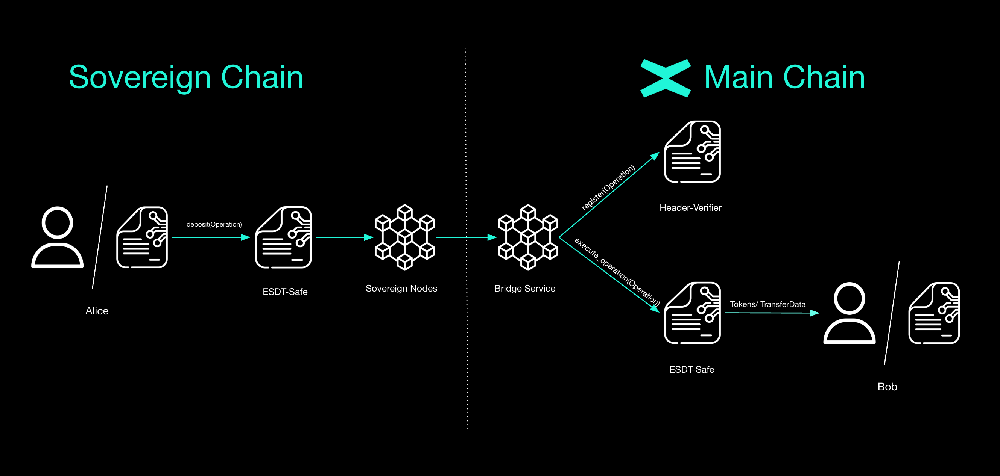

# Introduction

When we take a look at the blockchain industry, we observe a segregated ecosystem lacking cohesion, interoperability and teamwork. The vision lead to the Blockchain Revolution, knows as “Web3” — a new era of the internet that is user-centered, emphasizing data ownership and decentralized trust.

Sovereign Chains will dismantle the barriers between isolated blockchain networks by allowing smart contracts to seamlessly interact across different Sovereign Chains and the main MultiversX chain.
This cross-chain interoperability is crucial for fostering an environment where decentralized apps (dApps) can utilize functionalities or assets from across the ecosystem.

## What is Cross-Chain Execution?

Cross-Chain execution is the ability of a smart contracts or a decentralized applications on one blockchain to invoke actions on another blockchain. This feature allows for smart contract execution or transfer of funds from one chain to another, enabling developers to build applications that are chain agnostic.

## Cross-Chain Execution within Sovereign Chains

Since a Sovereign Chain is a separate blockchain with a different rule-set from the MultiversX blockchain, there has to be a way of communication between them. The interaction is being done by Smart Contracts, the Sovereign Bridge Service and Nodes. 

When a transaction starts from the MultiversX Mainchain, either from a wallet or a smart contract, it goes through the `Mvx-ESDT-Safe` smart contract. The Observer nodes pay attention to the events that the deposit transaction emits and then the Sovereign Nodes notarize the state changes inside the Sovereign Chain. This notarization means the end of either the Cross-Chain execution or Cross-Chain transfer.

When the transaction sender is from the Sovereign Chain, the `Sov-ESDT-Safe` smart contract must be used. The output of the transaction is read by the Sovereign Bridge Service. From that point there are two possible outcomes:
1. If the operation is not registered it has to be verified and registered by the `Header-Verifier` smart contract.
2. If the operation is registered, the Sovereign Bridge Service calls the `Mvx-ESDT-Safe` smart contract deployed on the MultiversX Mainchain to continue the transaction.

This is a high-level description of the whole process, the smart contracts that take place in it are far more detailed and have a lot of specific scenarios and behaviours. The current Sovereign Chain suite consists of four main contracts, here is the high-level description for some of the cross chain smart contracts:

## Mvx-ESDT-Safe & Sov-ESDT-Safe
The two contracts have the same role: to facilitate a cross-chain execution depending on what side the process starts. The reason for the prefix of `Sov` and `Mvx` is to show where the smart contract is deployed, `Sov` means that the contract is deployed on a Sovereign Chain and `Mvx` that is deployed on the MultiversX Mainchain. There will be an in-depth description of each smart contract in the upcoming modules ([`Mvx-ESDT-Safe`](mvx-esdt-safe.md) and [`Sov-ESDT-Safe`](sov-esdt-safe.md)). The description will consist of flows for the cross-chain interactions, important modules and endpoints. 

## Fee-Market
Since every Sovereign Chain will have a customizable fee logic, it was paramount that this configuration had to be separated into a different contract. There rules set inside this contract are: 
* fee per transferred token 
* fee per gas unit 
* users whitelist to bypass the fee

This contract is also present in the MultiversX mainchain and in any Sovereign Chain.

## Header-Verifier
When any transaction happens inside a Sovereign Chain is called and *operation*. The main role of this contract is to verify operations. They have to be signed by the validators of the Sovereign Chain. If the operation is successfully verified it will be registered and then can be executed by the `Mvx-ESDT-Safe` smart contract. All the *BLS keys* of the validators will be stored inside this contract. The in-depth description of how those _operations_ are registered can be found in the [`Header-Verifier`](header-verifier.md) module.

:::note
The source for the smart contracts can be found at the official [MultiversX Sovereign Chain SCs repository](https://github.com/multiversx/mx-sovereign-sc). 
:::

## Sovereign Bridge Service
This feature facilitates the execution of outgoing operations. This service is an application that receives Sovereign operations. After that, it will call the `execute_operation` endpoint from the `Mvx-ESDT-Safe` smart contract. The registration and execution of operations looks like this:

- For N operations there is only one [register transaction](from-sovereign.md#registering-a-set-of-operations) inside the Header-Verifier smart contract.
- N transactions for the [execution](from-sovereign.md#executing-an-operation) of N operations inside the ESDT-Safe smart contract, one execution transaction per operation.

> There can be one or more services deployed in the network at the same time.
